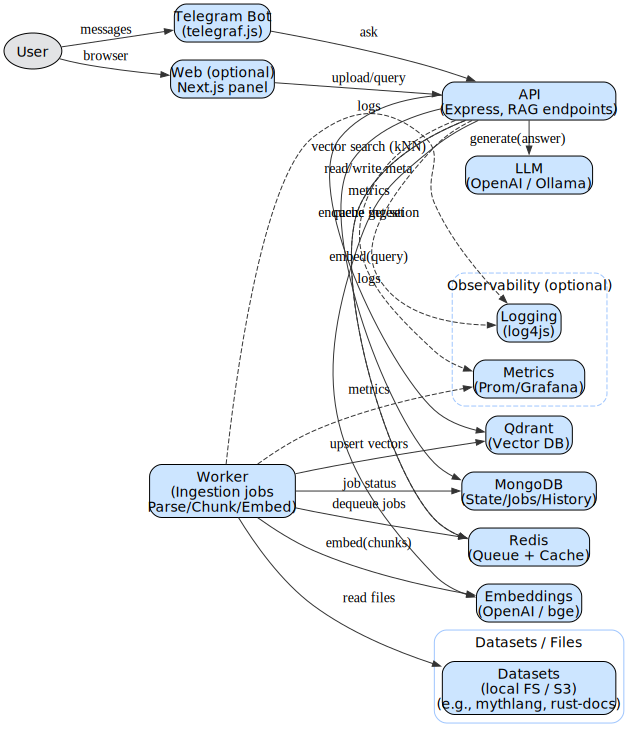

# AI RAG Showcase
This repository is a **showcase project** demonstrating **Retrieval-Augmented Generation (RAG)** using different datasets.  
It highlights how RAG can be applied to multiple domains: programming documentation, custom datasets, and even synthetic (fictional) data.

---


## Features
  - Universal **backend** in Node.js/TypeScript (Express).
  - **Qdrant** as the vector database for embeddings.
  - **Worker service** for ingestion (document parsing + embeddings).
  - **Telegram bot** built with [telegraf.js](https://github.com/telegraf/telegraf).
  - **Next.js web app** for testing queries and managing datasets.
  - Easily extensible: just drop a new dataset into `datasets/` and re-ingest.

---


## Project Structure
```
ai-rag-showcase/
├── apps/
│   ├── api/              # RAG API (Express).
│   ├── tg-bot/           # Telegram bot (telegraf.js).
│   ├── web/              # Next.js panel.
│   └── worker/           # Ingestion worker (BullMQ + Redis).
├── datasets/
│   └── mythlang/         # Fictional "MythLang" programming language.
├── packages/
│   ├── core/             # Shared RAG pipeline logic.
│   ├── embeddings/       # Embeddings providers (OpenAI/local).
│   ├── llm/              # LLM providers (OpenAI/Ollama).
│   ├── utils/            # Config, logger, helpers.
│   └── vectorstore/      # Qdrant wrapper.
├── docker-compose.yml
├── LICENSE
└── README.md
```

---


## Datasets Included
  - **MythLang** → a **fictional programming language for spells and rituals** (synthetic dataset).

---


## Tech Stack
  - **TypeScript**
  - **MERN** → MongoDB, Express.js, React/Next.js, Node.js.
  - **Qdrant** → Vector database for embeddings.
  - **Redis + BullMQ** → Job queue for ingestion.
  - **OpenAI API** → Embeddings + LLM (GPT-4o-mini).
  - **telegraf.js** → Telegram bot.

---


## Quick Start
```bash
git clone https://github.com/an-ivannikov/ai-rag-showcase
cd ai-rag-showcase

# Install dependencies
pnpm install

# Copy env file
cp .env.example .env

# Start vector DB + Redis + Mongo
docker compose --profile infra  --profile app build --no-cache
docker compose --profile infra  --profile app up --force-recreate -d

# Run backend + worker + bot
pnpm dev

curl -X POST http://localhost:3001/ingest \
  -H "Content-Type: application/json" \
  -d '{"dir":"./datasets/mythlang","meta":{"source":"mythlang_docs","lang":"en"}}'
```

---


## Example Interaction

**User:**  
```text
> How do I declare a function in MythLang?
```

**Bot:**  
```text
💡 Answer
Functions are declared using the ritual keyword. For example:
ritual functionName(parameters) {
  // function code here
}


You can refer to the "MythLang Syntax" chapter for more details.

📖 Sources
#1 intro.md 0 (score 0.680)
#2 syntax.md 0 (score 0.672)
#3 examples.md 0 (score 0.611)
```

---


## Architecture
.

---


## Purpose
This project is not meant as a production-ready system.
It’s a **portfolio showcase** to demonstrate:
  - Understanding of **RAG pipelines**.
  - Integration with **Telegram bots**.
  - Handling multiple datasets (real + synthetic).
  - Modern **MERN + vector DB** stack.

---


## License
MIT — feel free to fork and adapt.
